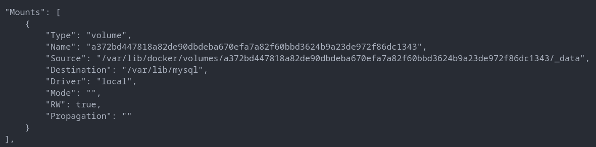
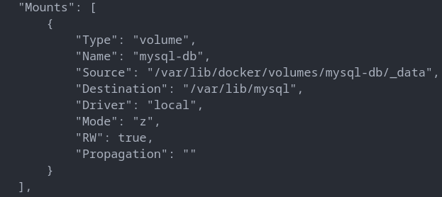

# Persistent data / volumes

Container are ususally immutable and ephemeral. How about databases or unique data which are required by the app but can not be part of image. Docker gives us features to unsure these "separation of concersn". This is known as "persistent data". There are tow ways to do it, Volumes and Bind Mounts.

## Volumes and Bind Mounts

Volumes are the preferred mechanism for persisting data generated by and used by Docker containers. While bind mounts are dependent on the directory structure and OS of the host machine, volumes are completely managed by Docker. Volumes have several advantages over bind mounts.

```shell
docker volume ls
```

- returns list of existing volumes

## Volume inside and outside of container

If we do not specify specify where the container volume will bind to in the host computer. Docker creates a dir in host and binds that with container's volume

```shell
docker container inspect mysql_no_volume
```

If we inspect the container, we are able to see the volume inside the container and


where did it bind to the host file system. In linux, it is easy to navigate to the bind dir and observe the data but in windos and mac, a linux VM is created by docker and the bind dir in the VM. It's not easy to access to bind dir in the VM. And the name of the volume is not user friendly.



### Volume flag during container run

```shell
docker container run -d --name mysql_with_vol_name -e MARIADB_ROOT_PASSWORD=pass -v mysql-db:/var/lib/mysql  mariadb
```

- `-v mysql-db:/var/lib/mysql`: `-v` for volume flag, `mysql-db` name of the bind volume in host. `/var/lib/mysql` volume inside the container.

```shell
docker container inspect mysql_with_vol_name
```

  

## Bind Mounting

Maps a host file or directory to a container file or directory. Basically just two locations pointing to the same file(s). If the dir already existed in the host, docker will not create during container run. Unlike volume name, in left side of `:` in bind mounting, we pass the total path of the dir in host and for the absolute path, it's always starts wity `/` and in right side we pass volume in container. As pathe structure are varied according to host system, so we can not include it to Dockerfile.

```shell
docker container run -d --name mysql_with_bind_mount -e MARIADB_ROOT_PASSWORD=pass -v /$(pwd)/mysql-db:/var/lib/mysql  mariadb
```

or

```shell
docker container run -d --name mysql_with_bind_mount -e MARIADB_ROOT_PASSWORD=pass -v ./mysql-db:/var/lib/mysql  mariadb
```

- both of the command create or use `mysql-db` dir in the current dir of host and all the containe data is stroed in that host dir.
- if it is a absolute path, it must starts with `/`.

```shell
docker container run -d -p 8080:80 --name nginx_server -v ./:/usr/share/nginx/html nginx
```

- `-v ./:/usr/share/nginx/html` : we are binding nginx's `/usr/share/nginx/html` volume to host's `./` (current dir). So, what ever html file is in the current directory will be served by nginx server.
