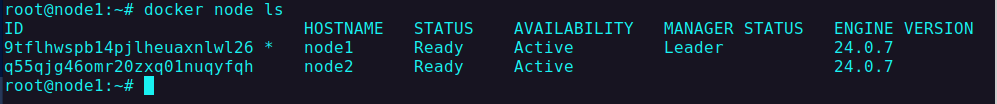

# Swarm

Swarm mode is an advanced feature for managing a cluster of Docker daemons. Use Swarm mode if you intend to use Swarm as a production runtime environment.

## Creating 3 node Swarn Cluster

- created three droplet in digital ocean and used ssh to connect to droplets
- installed docker in all three of the nodes

## in node1:

```shell
docker warm init
```

- it will give erros saing to use `--advertise-addr` tag with public ip address


- considering the error we run the following command

```shell
docker swarm init --advertise-addr 142.93.225.143
```

- it initialize the swarm in the current node
- it makes the current node as manager
- also gives command with token how to add worker to this swarm


## in node2:

```shell
docker swarm join --token SWMTKN-1-1fll5o62pj670w501mbo6qx6k5lvuz7c2255jrqx2wdzkx7tgr-9ajalzp9w1thlo7iaz5eouydl 142.93.225.143:2377
```

- node2 joined as worker in the swarm
  

### list all nodes in docker swarm

```shell
docker node ls
```

- return all the running container in the swarm
- all the node and swarm command can be executed only form manager node



### changing role of node2 to manager

```shell
docker node update --role manager node2
```

- now node2 is manager and node1 is worker

### get join token for worker

```shell
docker swarm join-token worker
```

- return command and token to add another node to the swarm


### Creating a `nginx` service

```shell
docker service create --name nginx_server -p 8080:80 -d --replicas 3 nginx
```


now in this following address we will be `http://167.71.74.208:8080/` nginx home page
