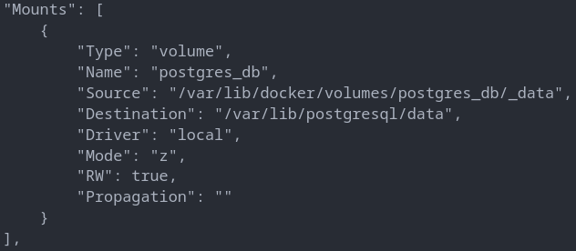
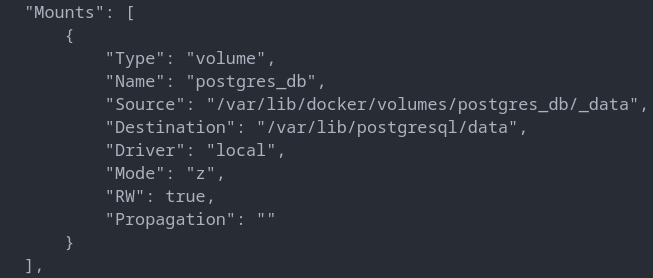

# Upgrade db from postgres 15.1 to 15.2 but new container will use old mount volume in host

```shell
docker container run -d --name postgres_15.1 -e POSTGRES_PASSWORD=PASS  -v postgres_db:/var/lib/postgresql/data postgres:15.1
```

```shell
docker container inspect postgres_15.1
```



Stopping the `postgres_15.1` contianer

```shell
docker container stop postgres_15.1
```

Creating new container with postgres:15.2 but will use same (`postgres_db`) volume from the host. Means all the data stored in the volume will be accessible from postgres_15.2 container.

```shell
docker container run -d --name postgres_15.2 -e POSTGRES_PASSWORD=PASS -v postgres_db:/var/lib/postgresql/data postgres:15.2
```

- created new container with updated version but using same volume from host

```shell
docker inspect postgres_15.2
```


