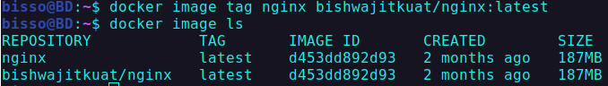

## Image

A Docker container image is a lightweight, standalone, executable package of software that includes everything needed to run an application: code, runtime, system tools, system libraries and settings.

### Layes in image

```shell
docker history nginx
```

- returns layes of nginx image

```shell
docker image inspect nginx
```

- retuns config info

### adding new tag with image

```shell
docker image tag nginx bishwajitkuat/nginx:latest
```

- `image tag`: base command to add tage to a image
- `nginx` : first parameter after `tag` command which is the source image. So we are making new image from this nginx official image.
- `bishwajitkuat/nginx:latest` : second parameter which takes new image name. Convention is that the word (`bishwajitkuat`) before slash is user name in docker hub, the word (`nginx`) after the slash is source image name. `:latest` is the tag associated with the image.
  

### Push Image to docker hub

```shell
docker image push bishwajitkuat/nginx:latest
```

- this will push `bishwajitkuat/nginx:latest` image to bishwajitkuat account in docker hub, if you are logged in in console.
