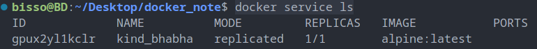
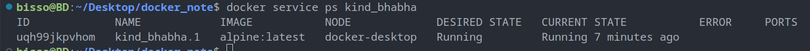
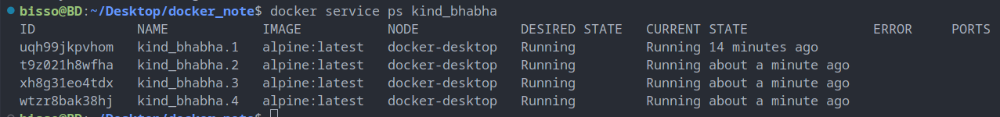

## Enabling swarm

```shell
docker info
```

if swarm is inactive

```shell
docker swarm inti
```

- activate swarm

### creating a service

```shell
docker service create alpine ping 8.8.8.8
```

### list all running services

```shell
docker service ls
```

creating 4 nginx servers

```shell
docker service create -d -p 80:80 --replicas 4 nginx
```

- when we deleted one containers swarn will create a new containers automatically. So, Swarn takes care of running the containes.



### containers inside a service

`docker service ps service_name/ID `

```shell
docker service ps kind_bhabha
```



### updating service

`docker service update [service name/ID] --replicas [number]`

```shell
docker service update kind_bhabha --replicas 4
```

- `service update kind_bhabha` : update `kind_bhabha` service
- `--replicas 4` : updated node number inside this service to 4
  

### removing a service

`docker service rm [service name/ID]`

```shell
docker service rm kind_bhabha
```

- removes kind_bhabha service and all container in it

### increase/decrease service replica with `scale`

```shell
docker service create --name nginx_service -p 80:80 nginx
```

```shell
docker service scale nginx_service=5
```

### rolling update of `--image`

```shell
docker service update --image nginx:1.13.6 nginx_service
```

### add/remove publish ports with `--publish-rm` & `--publish-add` flags

```shell
docker service update --publish-rm 80 --publish-add 8080:80 nginx_service
```

### spreading service to least used node in swarm with `--force`

```shell
docker service update --force nginx_service
```

- the updated nginx_service with be placed into the least used node in the swarm.
