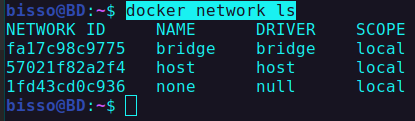
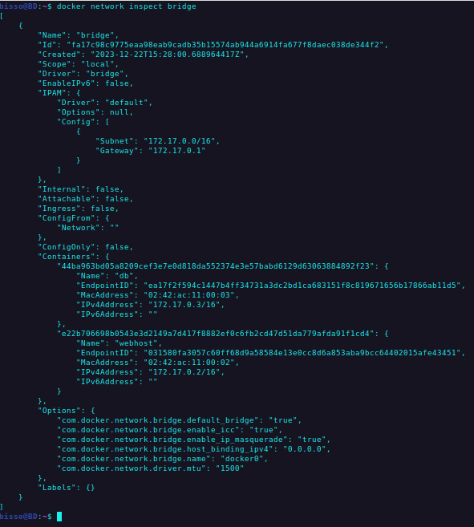

# Docker Network

By defaul each container is conected to a private virtual network called "bridge". When we exposed a port, it goes through virtual network to NAT firewall and exposed the port in host.

All container on a virtual network can talk to each other withoug publishing their ports for host, if the container belongs to same virtual network in docker such as "bridge" or other custom network.

### Port of a container

```shell
docker container port container_name
```

- return the exposed port of the container.

### IP address of the container

```shell
docker container inspect --format "{{ .NetworkSettings.IPAddress}}" container_name
```

- returns ip address of the container
- --format : this flag is used to filter the output form inpect

### All networks in docker

```shell
docker network ls
```

- returns all networks in docker
  

### Inspect a network

```shell
docker network inspect network_name
```

- return detail info of the network including containers attached to this virtual network.
  

### Createing a network

```shell
docker network create my_app_net
```

### Attaching container to network when creating container

```shell
docker container run -d -p 8080:80 --name new_nginx --network my_app_net nginx:alpine
```

- creating new_nginx container from nginx:apline image
- --network : with this flage, we are attaching new_nginx container with `my_app_net` network in docker.

### Connecting and disconnecting containers to a newtork

command pattern: `docker network connect/disconnect network container`

```shell
docker container run -d --name web_host nginx:alpine
```

- running web_host container from nginx:alpine and we not exposing port. To prove, container in same network can communicate without exposing port to host.
- by default web_host container attach to bridge network

```shell
docker network connect my_app_net web_host
```

- connecting `web_host` container to `my_app_net` network
- currently `web_host` container is connected to both `bridge` and `my_app_net` networks. One container could be connected to multiple newtworks.

```shell
docker network disconnect bridge web_host
```

- disconnecting web_host container from bridge network.

### Docker DNS

Docker daemon has a built-in DNS server that containers use by dfault. Docker defaults the hostname to the container's name, but you can also set aliases. So, container are able to talk to each other by container name. IP addresse of the container are too dynamic, so we can not rely on ip addresses to talk to each other. Container name is fixed.

```shell
docker container exec -it new_nginx ping web_host
```

- we are pinging `web_host` from `new_nginx`
- eventhough `web_host` container does not exposed any port, it still can communicate with `new_nginx` container because they are in the same network `my_app_net`.
